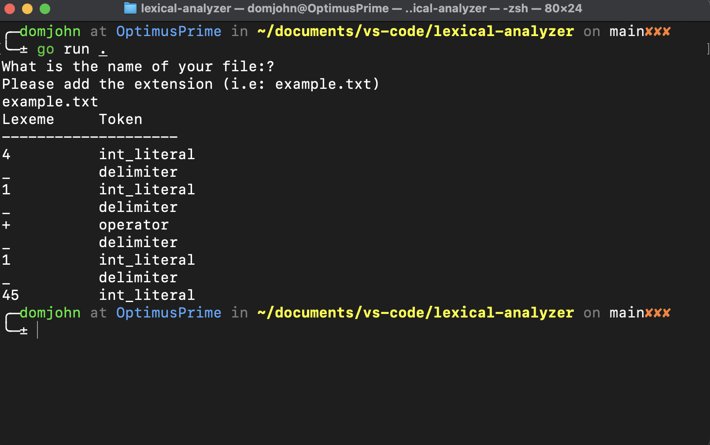
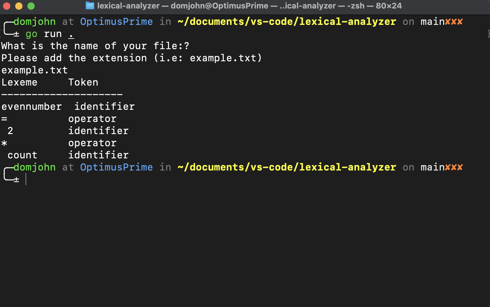
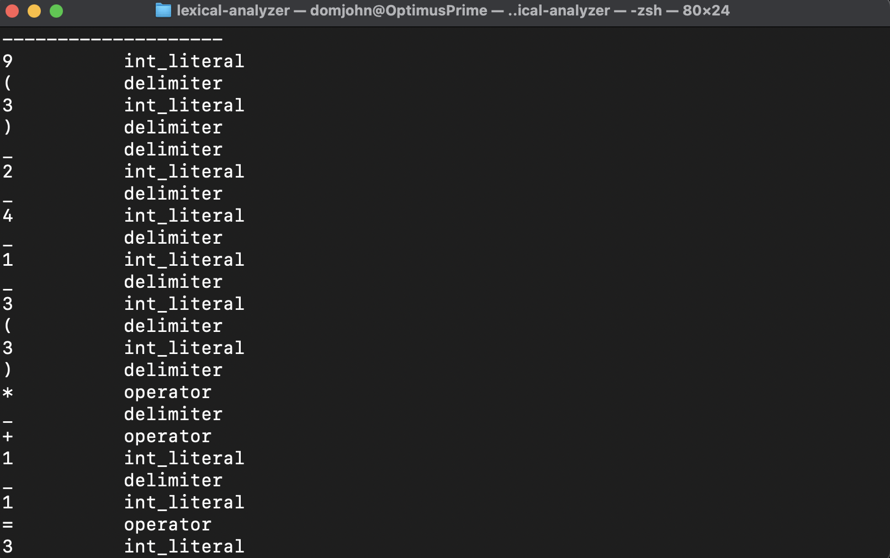

# Getting Started

1. Make sure you have Go installed (version 1.23.2 or later) https://go.dev/doc/install
2. Clone the repository
3. Add create new .txt file or add to Exisitng File names.txt
4. then run `go run main.go` in the terminal.

# Lexical Analyzer

A simple lexical analyzer written in Go that tokenizes input files and identifies basic programming language constructs.

## Description

This program reads a text file from a user and breaks down its contents into tokens, classifying them into the following categories. These are also the allowed input:

- Identifiers
- Integer literals
- Operators (+, -, *, /, =)
- Delimiters ((, ), {, }, [, ], ;, _)

Commas and whitespace don't get noticed as a deleimiters and will not be read by the program. Which will in turn result in program giving wrong type names.
The program is interactive based on what's in the text file the user inputs.
I'm using Structs to store lexeme token parts, Scanner to iterate through words in file and a basic linear search algo.Thre output represents indentifiers, integers, operartors, delimiters.

## Outputs

I'm testing the program to read a string

I'm testing the program to see the output when given spaces a invalid input.

I am testing the program to read a long string
